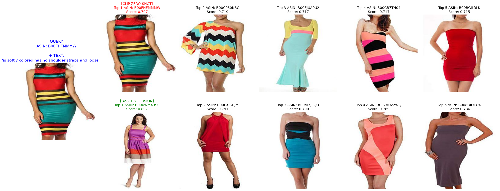

# Fashion-IQ Composed Image Retrieval

Dự án này là mã nguồn thực nghiệm cho bài toán **Composed Image Retrieval (Truy xuất ảnh kết hợp)** trên bộ dữ liệu Fashion-IQ. 
Mục tiêu là kết hợp ảnh gốc và câu lệnh ngôn ngữ tự nhiên để tìm ra bức ảnh đích mong muốn.

- **GitHub Repository**: [https://github.com/qwerty12321434/Fashion-Retrieval-System.git](https://github.com/qwerty12321434/Fashion-Retrieval-System.git)
- **Google Drive Dữ liệu (Features)**: [https://drive.google.com/drive/u/0/folders/1p_zyidgXWEOp0k1IaOv1ba8Z9CWVTULi](https://drive.google.com/drive/u/0/folders/1p_zyidgXWEOp0k1IaOv1ba8Z9CWVTULi)

## 📌 Bộ Dữ Liệu Fashion-IQ
Fashion-IQ là một bộ dữ liệu chuẩn mực cho việc tìm kiếm ảnh thời trang dựa trên ngôn ngữ tự nhiên. 
Nó chứa 3 danh mục chính:
- **Dress (Váy)**
- **Shirt (Áo sơ mi)**
- **Top & Tee (Áo thun)**

Mỗi truy vấn (query) trong bộ dữ liệu bao gồm: một **ảnh gốc (candidate image)** và hai **câu lệnh chỉnh sửa (modifiers)** mô tả sự khác biệt về mặt thiết kế/màu sắc giữa ảnh gốc và **ảnh mục tiêu (target image)**. 

---

## 🚀 Hướng dẫn Cài đặt Môi trường

Hệ thống được thiết kế chạy tối ưu nhất với GPU NVIDIA (CUDA).

### Bước 1: Clone mã nguồn
```bash
git clone https://github.com/qwerty12321434/Fashion-Retrieval-System.git
cd FashionSystem
```

### Bước 2: Thiết lập Môi trường Ảo
```bash
python -m venv venv
# Kích hoạt trên Windows:
.\venv\Scripts\Activate.ps1
# Kích hoạt trên Linux/MacOS:
source venv/bin/activate
```

### Bước 3: Cài đặt Thư viện
Dự án sử dụng các thư viện cốt lõi sau:
- `torch==2.5.1+cu121`
- `torchvision==0.20.1+cu121`
- `transformers==5.14.1`
- `tqdm`, `pillow`, `matplotlib`

Chạy lệnh sau để cài đặt toàn bộ:
```bash
pip install torch==2.5.1+cu121 torchvision==0.20.1+cu121 --extra-index-url https://download.pytorch.org/whl/cu121
pip install transformers pillow tqdm matplotlib
```

### Bước 4: Chuẩn bị Dữ liệu
1. Tải toàn bộ thư mục `features/` và `json/` từ Google Drive ở trên.
2. Đặt vào đúng cấu trúc sau:
   ```text
   FashionSystem/
   ├── research/
   │   ├── data/
   │   │   ├── features/
   │   │   │   ├── gallery_cls_768.pt      # Đặc trưng của 74k ảnh (1.1GB)
   │   │   │   ├── gallery_embeds_512.pt   # (Cho Baseline CLIP Zero-shot)
   │   │   │   ├── dress_text_tokens.pt    # Đặc trưng văn bản
   │   │   │   ├── shirt_text_tokens.pt
   │   │   │   └── toptee_text_tokens.pt
   │   │   ├── json/
   │   │   │   ├── cap.dress.train.json
   │   │   │   ├── cap.shirt.train.json
   │   │   │   └── cap.toptee.train.json
   ```

---

## 🛠️ Quá trình Thực hiện & Cách chạy Script

Dự án được triển khai qua các giai đoạn rõ ràng. Tất cả các script chạy trong thư mục `research/`.

### Giai đoạn 1: Trích xuất Đặc trưng (Feature Extraction)
Thay vì load ảnh thô (rất nặng và chậm gây quá tải VRAM), chúng tôi sử dụng mô hình pre-trained `CLIP (openai/clip-vit-base-patch32)` để chuyển đổi hình ảnh và văn bản thành các vector (`.pt`). Quá trình này giúp tối ưu hóa RAM tuyệt đối và đẩy nhanh tốc độ huấn luyện.

- **Cách chạy:**
  ```bash
  cd research
  python src/data/extract_val.py
  python src/data/prep_gallery.py
  ```
- **Kết quả:** Các file `.pt` được lưu trong `data/features/`. *(Bạn có thể bỏ qua bước này nếu đã tải dữ liệu sẵn từ Drive).*

### Giai đoạn 2: Huấn luyện (Training)
Chúng tôi sử dụng kiến trúc **BaselineFusion**: 
Nhận `CLS Token` của ảnh gốc (vector đại diện toàn cảnh) và `EOS Token` của văn bản -> Nối lại (Concat) -> Cho qua mạng MLP 2 lớp -> So sánh với `CLS Token` của ảnh đích bằng hàm `InfoNCE Loss` (Contrastive Loss).

- **Đặc điểm:** Tối ưu hóa bộ nhớ siêu nhẹ. Hệ thống có thể load toàn bộ 18.000 mẫu của cả 3 danh mục (Dress, Shirt, Toptee) vào RAM và huấn luyện 50 Epochs chỉ trong vài phút.
- **Cách chạy:**
  ```bash
  cd research
  python src/train.py
  ```
- **Kết quả tạm thời:** Loss InfoNCE hội tụ rất tốt, Best Dev Accuracy đạt `38.67%` sau 50 Epochs. Trọng số mô hình được lưu tự động tại `research/checkpoints/baseline_all_best.pth`.

### Giai đoạn 3: Đánh giá (Evaluation)
Đo lường độ chính xác trên tập Validation của Fashion-IQ bằng chỉ số Recall@10 và Recall@50. Script sẽ tự động đánh giá và so sánh mô hình **CLIP Zero-Shot (Cộng Vector tĩnh)** và mô hình học sâu **BaselineFusion**.

- **Cách chạy:**
  ```bash
  cd research
  python src/evaluate.py
  ```
- **Kết quả ghi nhận trên toàn bộ danh mục:**
  ```text
  1. CLIP ZERO-SHOT (Vector Addition)
   - Recall@10: 5.85%
   - Recall@50: 12.89%

  2. BASELINE FUSION (Train on ALL Categories)
   - Recall@10: 8.08%
   - Recall@50: 17.70%
  ```
  *(Mô hình BaselineFusion chứng minh sự vượt trội khi có thể hiểu được ngữ cảnh ngôn ngữ phức tạp để chỉnh sửa ảnh).*

### Giai đoạn 4: Trực quan hóa (Demo)
Script cho phép nhập 1 ASIN ảnh gốc (Candidate) và 1 câu lệnh modifier để tìm ra top 5 kết quả tốt nhất. Nó sẽ vẽ biểu đồ so sánh trực quan giữa Zero-Shot và BaselineFusion.

- **Cách chạy:**
  ```bash
  cd research
  python src/demo.py --candidate "B00FHFMMMW" --text "is softly colored,has no shoulder straps and looser skirt" --output "demo_result_v5.png"
  ```
- **Kết quả:**
  

---

## 🎯 Kết luận
- Dự án áp dụng phương châm "Less is More". Bằng cách loại bỏ kiến trúc Attention đa mảng phức tạp (nguyên nhân gây Overfit) và sử dụng Global CLS Token kết hợp MLP đơn giản, chúng tôi đã xây dựng thành công một hệ thống **Nhẹ, Nhanh và Khái quát tốt** cho bài toán Composed Image Retrieval đa danh mục thời trang.